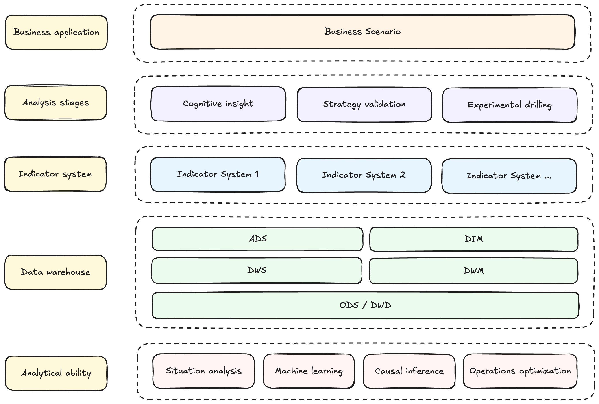

# Systematization-of-data-analysis
[![GitHub license][license-badge]][license-url]

[license-badge]: https://img.shields.io/badge/license-MIT-green
[license-url]: https://github.com/ZhixinChang/Systematization-of-data-analysis/blob/main/LICENSE

Methodology for the entire process system of data-driven decision-making.

## What can this do for you?
In practical data application scenarios, the specific definition of the entire data analysis process system and its components has been clarified, promoting data-driven value presentation, transmission, and circulation, and facilitating better data-driven decision-making.

### Suitable Audience
- Data analyst.
- Data scientist.
- Enthusiasts dedicated to data science applications.

## Getting Started
The data-driven decision-making process system consists of three analysis stages: cognitive insight, strategy validation, and experimental drilling. In addition, it also includes three supporting components: analytical ability, data warehouse, and indicator system. And we implement the application of data-driven decision-making in three stages through these supporting components.

### Analysis stages
The essence of the value of analysis is to bring cognition to people. Therefore, the analysis stages is mainly matched with the pre project, project promotion, and post project promotion, and its analysis objectives correspond to acquiring cognition, iterative cognition, and review cognition, respectively.

| Stages | Key Objectives | Key Results | Details |
|:------:|----------------|-------------|:-------:|
| Cognitive insight | **Acquiring cognition**. Provide sufficient data awareness for the business before project execution, and make objective optimization decisions driven by data. | 1. Determine the priority of optimizing multiple performance indicators. 2. Evaluate the impact of work indicators on business indicators. 3. Reveal the optimization space of work indicators. | [Learn more][cognitive insight] |
| Strategy validation | **Iterative cognition**. Provide AB testing and evaluate the effectiveness of optimization strategies during project execution, using data-driven strategy iteration and optimization. | 1. Design AB testing for strategy optimization. 2. Evaluate the impact of strategy AB testing. | [Learn more][strategy validation] |
| Experimental drilling | **Review cognition**. In the later stage of project execution, when the strategy effect is not ideal, based on experimental data, further explore the optimization space of sensitive population for strategy/work indicators to further clarify whether additional sensitive population strategies are needed. When the effectiveness of the strategy is ideal, perhaps we are also interested in the chain and degree of the impact of the strategy on the business, which can guide us in other optimizations in the future. | 1. Reveal the impact chain and degree of strategies on business. 2. Identify sensitive populations for strategies/indicators. | [Learn more][experimental drilling] |

[cognitive insight]: cognitive-insight "cognitive insight"
[strategy validation]: strategy-validation "strategy validation"
[experimental drilling]: experimental-drilling "experimental drilling"

### Supporting components
Supporting components are the fundamental capabilities for implementing a data-driven decision-making process system. Using analytical ability as the engine, data warehouse as the fuel, and indicator system as the direction of work, drive the value presentation, transmission, and circulation of all stages of data analysis, and ultimately achieve business impact.

| Components | Target | Details |
|:----------:|--------|:-------:|
| Analytical ability | The application capabilities of algorithms such as causal inference, machine learning, and operations research optimization are not just limited to the current situation. | [Learn more][analytical ability] |
| Data warehouse | The thinking of data processing pipeline is to ensure the reliability of data results, rather than fragmented data extraction and processing. | [Learn more][data warehouse] |
| Indicator system | Quantify all things that can do work as work indicators, and improve business indicators by intervening in work indicators. | [Learn more][indicator system] |

[analytical ability]: analytical-ability "analytical ability"
[data warehouse]: data-warehouse "data warehouse"
[indicator system]: indicator-system "indicator system"

